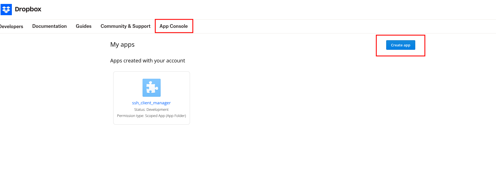

# **SSH Client Manager - Installation Guide**

## **1. Download and Setup**

### **Clone the GitHub Repository**

```bash
git clone https://github.com/cyperdev/SSHClientManager.git
cd SSHClientManager
```

### **Create and Activate a Virtual Environment**

```bash
python -m venv venv
source venv/bin/activate  # On macOS/Linux
venv\Scripts\activate     # On Windows
```

### **Install Dependencies**

```bash
pip install -r requirements.txt
```

---

## **2. Dropbox Integration Setup**

1. **Create a Dropbox Account** (if you don’t have one) at [Dropbox](https://www.dropbox.com/).
2. **Create an App**:
    - Go to [Dropbox App Console](https://www.dropbox.com/developers/apps).
    - Click **"Create App"**.
		
    - Choose **Scoped Access**.
    - Select **App Folder** – access is limited to a single folder created for your app.
    - Name the app: `ssh_client_manager`.
	    ![[Images/dropbox2.png]]
3. **Set Permissions**:
    - Navigate to **Permissions** under **Files and Folders**.
    - Enable:
        - `files.content.write`
        - `files.content.read`
        ![[images/dropbox3.png]]
4. **Generate API Key**:
    - Go back to **Settings**.
    - Click **Generate** under OAuth2 access token.
	    ![[images/dropbox4.png]]
    - Save the token in `drop_box_config.json` under the `.ssh_client_manager` folder in your home directory.
    - _(If `.ssh_client_manager` is not found, simply run the application and exit; the folder will be created automatically.)_

---

## **3. Google Drive Integration Setup**

5. **Go to Google Cloud Console** at [Google Cloud Console](https://console.cloud.google.com/).
6. **Create a New Project**:
    - Click **Select a project ➝ New Project ➝ Create**.
	    ![[images/google1.png]]
    - Name it **DriveAPI**.
	    ![[images/google2.png]]
7. **Enable Google Drive API**:
    - Under **APIs & Services**, select **Enable APIs and Services**.
	    ![[images/google3.png]]
    - Click **ENABLE APIS AND SERVICES**
	    ![[images/google4.png]]
    - Under **Google Workspace**, search for **Google Drive API** and click **Enable**.
	    ![[images/google5.png]]
	    ![[images/google6.png]]
8. **Set Up OAuth Consent Screen and Create OAuth Credentials**:
    - Navigate to **OAuth consent screen**.
	    ![[images/google7.png]]
    - Click **Get Started**.
	    ![[images/google8.png]]
    - Provide **App Name**, select your email for **User Support Email**, and click **Next**.
	    ![[images/google9.png]]
    - Under **Audience**, select **External** and click **Next**.
	    ![[images/google10.png]]
    - Under **Contact Information**, enter your email address and click **Next**.
	    ![[images/google11.png]]
    - Under **Finish**, tick the **Terms of Service** checkbox and click **Continue**.
	    ![[images/google12.png]]
    - Click **Create** → Click **Create OAuth Client**.
		![[images/google13 1.png]]
	    ![[images/google14.png]]
    - Under **Application Type**, select **Desktop App**.
	    - Provide a name: `ssh_client_manager` and click **Create**.
		![[images/google15.png]]
    - Under **Publishing Status**, click **Publish App**.
	    ![[images/google18.png]]
9. **Download and Save Credentials**:
    - Download the `client_secret_SOME_RANDOM_CHAR.json` file.
    - Rename it to `credentials.json` and move it to the `.ssh_client_manager` folder in your home directory.
	    ![[images/google16 1.png]]
	    ![[images/google17.png]]
    - _(If `.ssh_client_manager` is not found, simply run the application and exit; the folder will be created automatically.)_
10. **Authenticate and Generate Token**:
    - Run the application; it will open a browser for authentication.
    - Alternatively, copy the URL shown in the terminal and visit it manually to authenticate.
	    ![[images/google19.png]]
    - Once authentication is completed, the `token.json` file will be automatically downloaded into the `.ssh_client_manager` folder.
