# **SSH Client Manager - Installation Guide**

## **1. Download and Setup**

### **Clone the GitHub Repository**

```bash
git clone https://github.com/cyperdev/SSHClientManager.git
cd SSHClientManager
```

### **Create and Activate a Virtual Environment**

```bash
python -m venv venv
source venv/bin/activate  # On macOS/Linux
venv\Scripts\activate     # On Windows
```

### **Install Dependencies**

```bash
pip install -r requirements.txt
```

---

## **2. Dropbox Integration Setup**

1. **Create a Dropbox Account** (if you don’t have one) at [Dropbox](https://www.dropbox.com/).
2. **Create an App**:
    - Go to [Dropbox App Console](https://www.dropbox.com/developers/apps).
    - Click **"Create App"**.
		
    - Choose **Scoped Access**.
    - Select **App Folder** – access is limited to a single folder created for your app.
    - Name the app: `ssh_client_manager`.
	    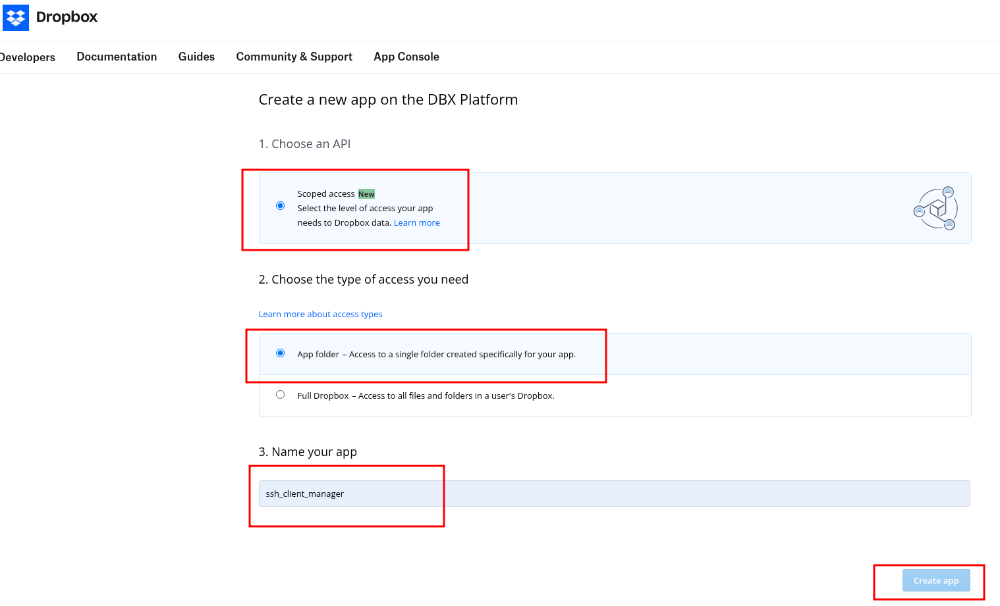
3. **Set Permissions**:
    - Navigate to **Permissions** under **Files and Folders**.
    - Enable:
        - `files.content.write`
        - `files.content.read`
        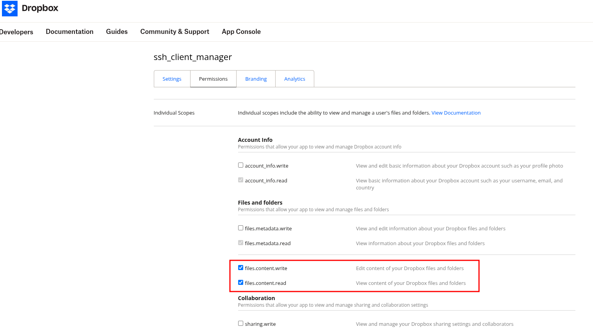
4. **Get AUTH CODE and Oauth Refresh Token**:
    - Go back to **Settings**.
      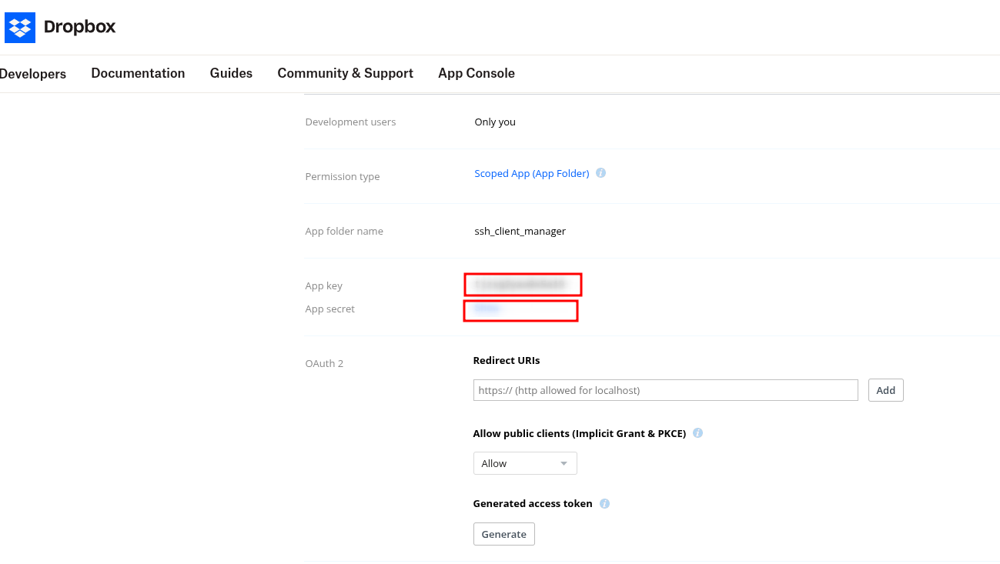
    - Replace the APPKEY and Visit- https://www.dropbox.com/oauth2/authorize?client_id=APPKEYHERE&response_type=code&token_access_type=offline
    - Click Continue
      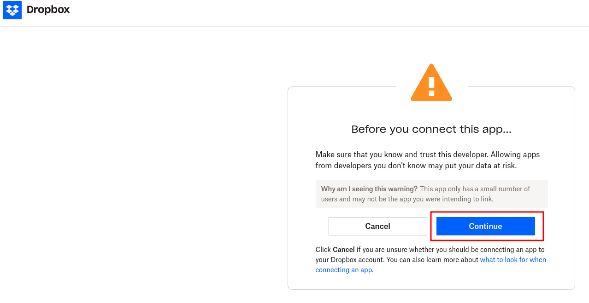
    - Click Allow
      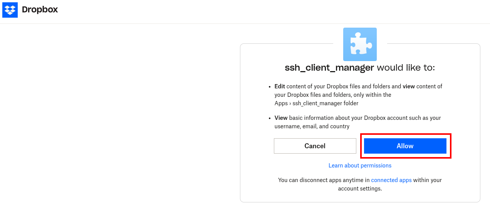
    - Copy the Auth Code
      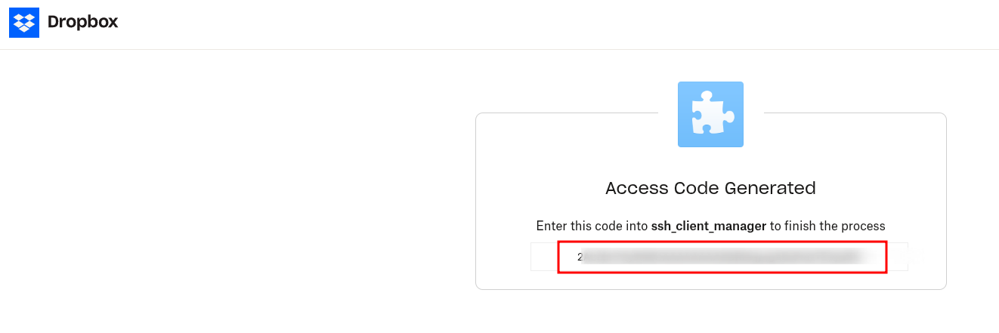
        ```
        curl https://api.dropbox.com/oauth2/token \
	    -d code=AUTH_CODE \
	    -d grant_type=authorization_code \
	    -u APPKEYHERE:APPSECRETHERE​
       ```
    - Copy Refresh token ```refresh_token```
      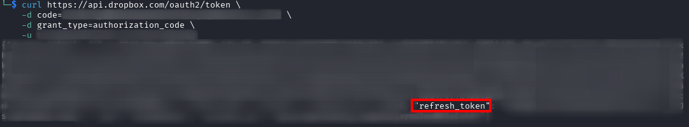
    - Save the app_key, app_secret and refresh_token in `drop_box_config.json` under the `.ssh_client_manager` folder in your home directory.
    - _(If `.ssh_client_manager` is not found, simply run the application and exit; the folder will be created automatically.)_

---

## **3. Google Drive Integration Setup**

1. **Go to Google Cloud Console** at [Google Cloud Console](https://console.cloud.google.com/).
2. **Create a New Project**:
    - Click **Select a project ➝ New Project ➝ Create**.
	    
    - Name it **DriveAPI**.
      
	    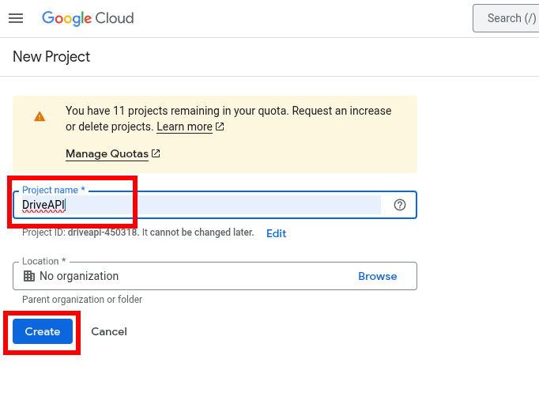
3. **Enable Google Drive API**:
    - Under **APIs & Services**, select **Enable APIs and Services**.
	    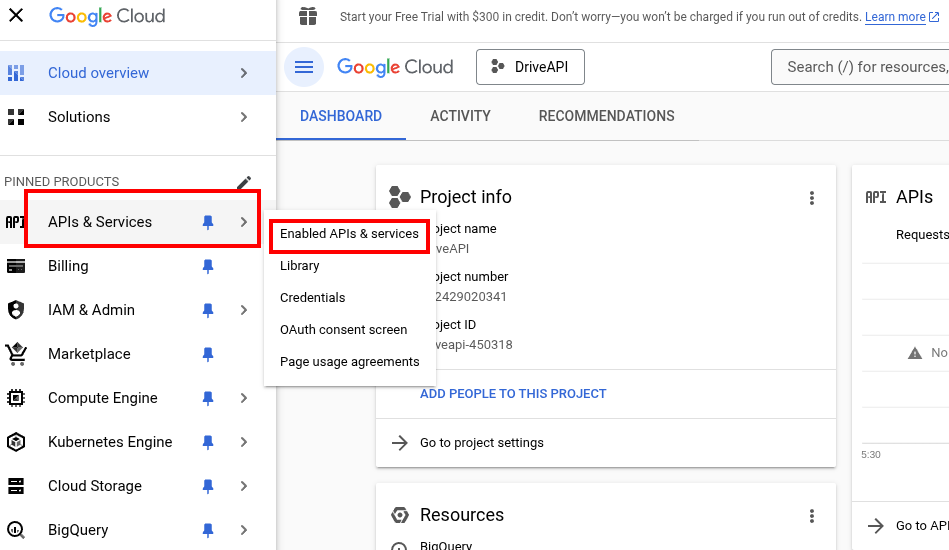
    - Click **ENABLE APIS AND SERVICES**
	    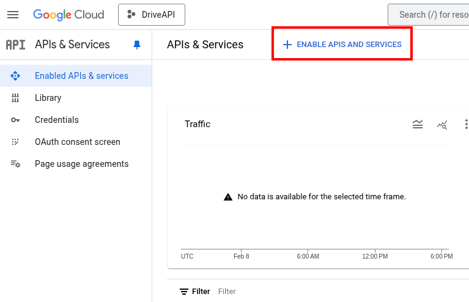
    - Under **Google Workspace**, search for **Google Drive API** and click **Enable**.
	    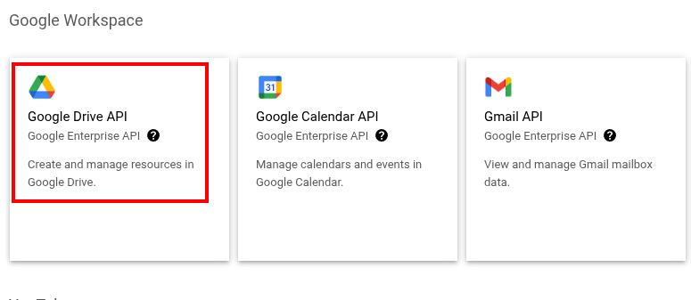
	    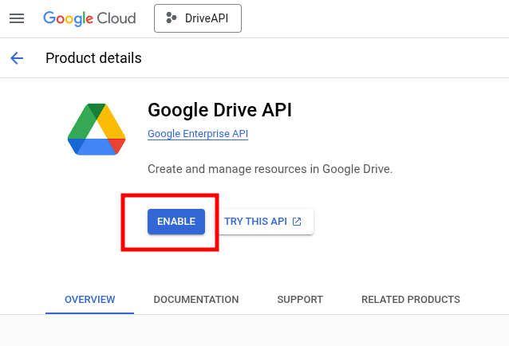
4. **Set Up OAuth Consent Screen and Create OAuth Credentials**:
    - Navigate to **OAuth consent screen**.
	    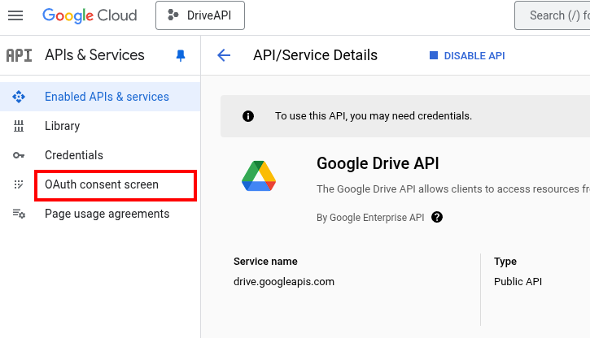
    - Click **Get Started**.
	    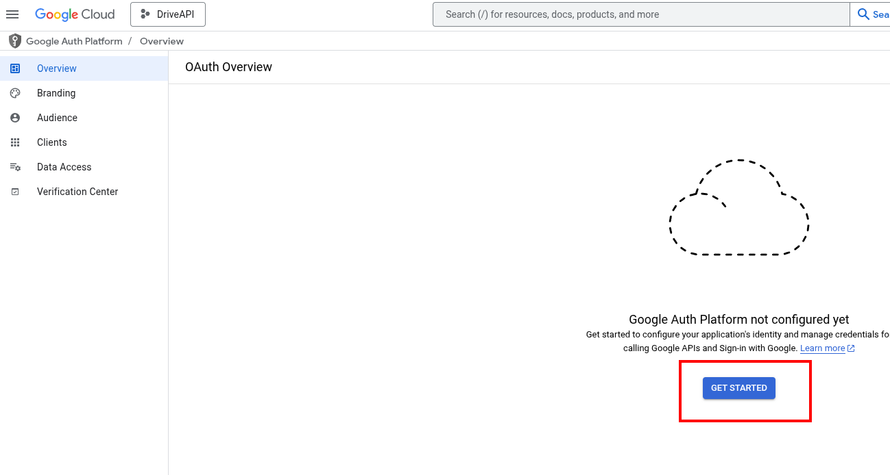
    - Provide **App Name**, select your email for **User Support Email**, and click **Next**.
	    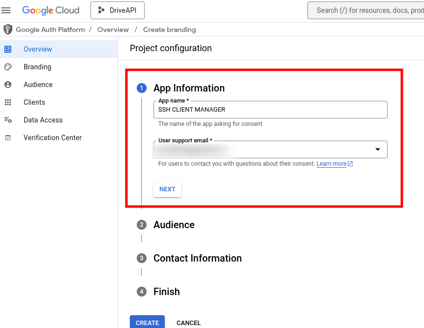
    - Under **Audience**, select **External** and click **Next**.
	    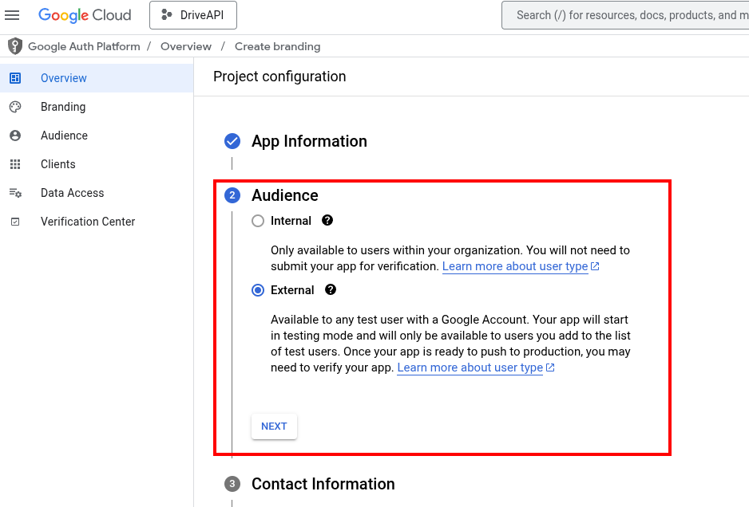
    - Under **Contact Information**, enter your email address and click **Next**.
	    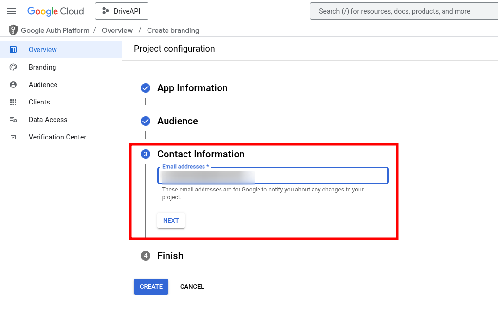
    - Under **Finish**, tick the **Terms of Service** checkbox and click **Continue**.
	    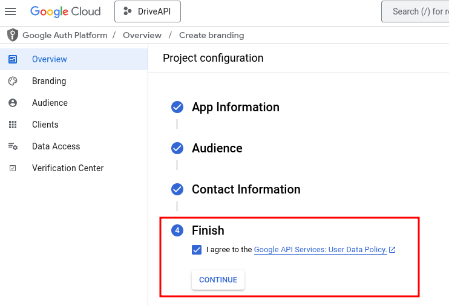
    - Click **Create** → Click **Create OAuth Client**.
		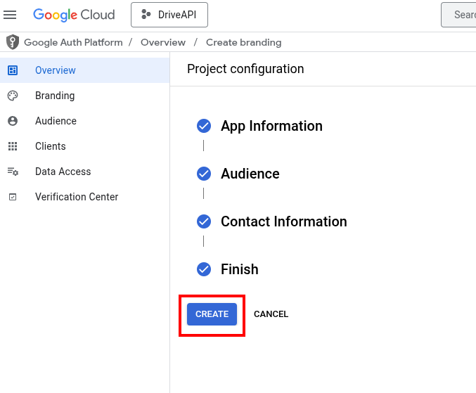
	    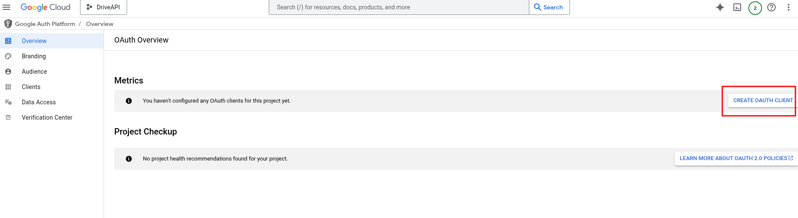
    - Under **Application Type**, select **Desktop App**.
	    - Provide a name: `ssh_client_manager` and click **Create**.
		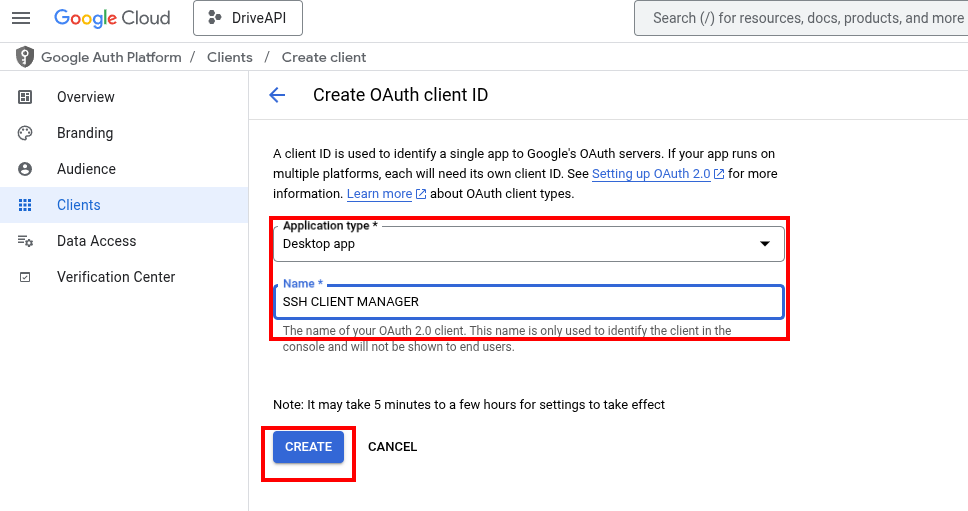
    - Under **Publishing Status**, click **Publish App**.
	    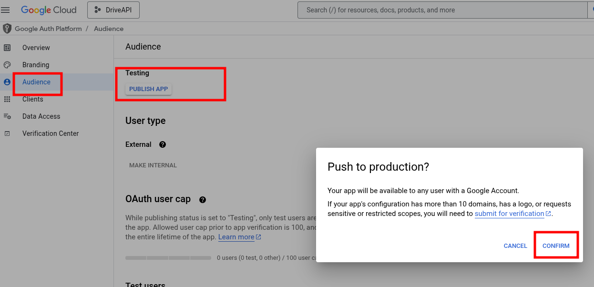
5. **Download and Save Credentials**:
    - Download the `client_secret_SOME_RANDOM_CHAR.json` file.
    - Rename it to `credentials.json` and move it to the `.ssh_client_manager` folder in your home directory.
	    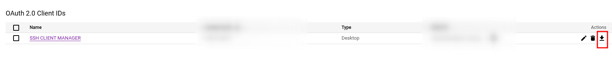
	    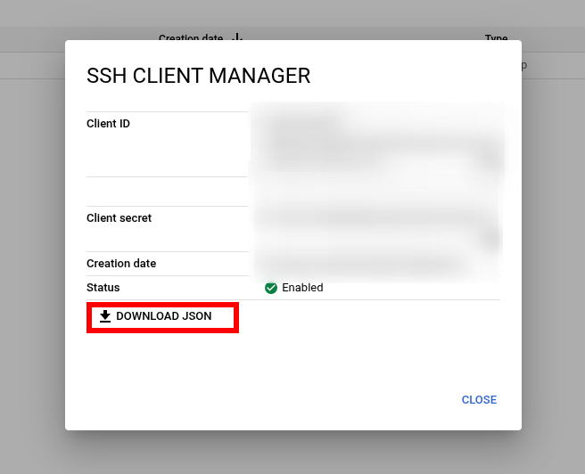
    - _(If `.ssh_client_manager` is not found, simply run the application and exit; the folder will be created automatically.)_
6. **Authenticate and Generate Token**:
    - Run the application; it will open a browser for authentication.
    - Alternatively, copy the URL shown in the terminal and visit it manually to authenticate.
	    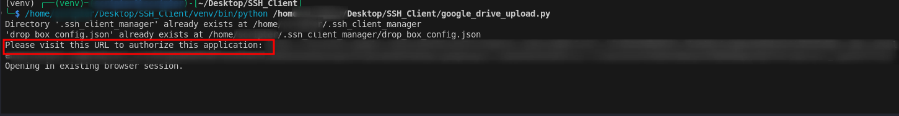
    - Once authentication is completed, the `token.json` file will be automatically downloaded into the `.ssh_client_manager` folder.

---
## Run the script
```bash
python SSHClientManager.py
```
